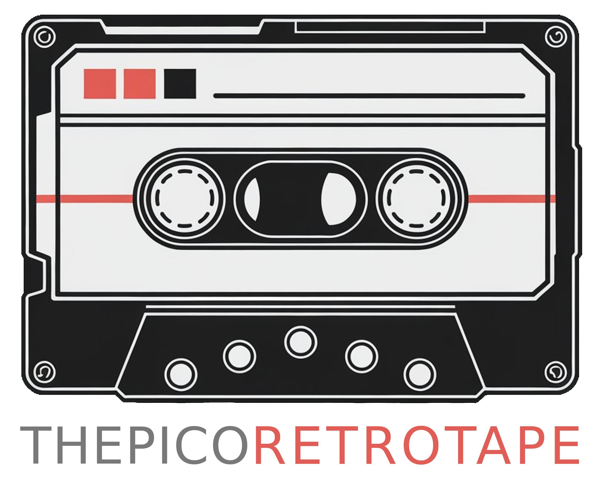

# ThePicoRetroTape


ThePicoRetroTape ist ein Projekt von Thorsten Kattanek, das einen Raspberry Pi Pico verwendet, um TAP-Dateien für den Commodore Datasette 1530 zu lesen und anzuzeigen. Das Projekt umfasst die Verwendung eines ST7735-TFT-Displays zur Anzeige von Dateiinformationen und die Steuerung über Tasten.

## Inhaltsverzeichnis

- [Hardware](#hardware)
- [Software](#software)
- [Installation](#installation)
- [Verwendung](#verwendung)
- [Dateistruktur](#dateistruktur)
- [Funktionen](#funktionen)
- [Lizenz](#lizenz)

## Hardware

### Benötigte Komponenten

- Raspberry Pi Pico
- ST7735 TFT-Display
- SD-Kartenmodul
- Tasten (Play, Up, Down, Enter)
- Commodore C64 / C128 / VC-20 / C16 / PET

### Pinbelegung

| Funktion           | Pin am Pico | GPIO-Nummer |
|--------------------|-------------|-------------|
| Play Button        | 26          | 20          |
| Key Up             | 9           | 6           |
| Key Down           | 10          | 7           |
| Key Enter          | 11          | 8           |
| C1530 Tape Read    | 4           | 2           |
| C1530 Tape Write   | 6           | 4           |
| C1530 Tape Sense   | 5           | 3           |
| C1530 Tape Motor   | 7           | 5           |
| TFT SCK            | 14          | 10          |
| TFT MOSI           | 15          | 11          |
| TFT RST            | 17          | 13          |
| TFT DC             | 20          | 15          |
| TFT CS             | 19          | 14          |

## Software

### Abhängigkeiten

- [Pico SDK](https://github.com/raspberrypi/pico-sdk)
- [FatFs](http://elm-chan.org/fsw/ff/00index_e.html)
- [ST7735 TFT Library](https://github.com/adafruit/Adafruit-ST7735-Library)

### Installation

1. Klonen Sie das Repository:
    ```sh
    git clone https://github.com/ThKattanek/the_pico_retro_tape.git
    cd the_pico_retro_tape
    ```

2. Erstellen Sie das Build-Verzeichnis und kompilieren Sie das Projekt:
    ```sh
    mkdir build
    cd build
    cmake ..
    make
    ```

3. Laden Sie die Firmware auf den Raspberry Pi Pico hoch:
    ```sh
    cp the_pico_retro_tape.uf2 /media/<username>/RPI-RP2/
    ```

## Verwendung

1. Schließen Sie die Hardware gemäß der Pinbelegung an.
2. Legen Sie eine SD-Karte mit TAP-Dateien in das SD-Kartenmodul ein.
3. Schalten Sie den Raspberry Pi Pico ein.
4. Verwenden Sie die Tasten, um durch die Dateien auf der SD-Karte zu navigieren und eine Datei auszuwählen.

### Tastenfunktionen

- **Play Button**: Startet das Lesen der TAP-Datei und übertragung zum C64.
- **Key Up**: Navigiert nach oben in der Dateiliste.
- **Key Down**: Navigiert nach unten in der Dateiliste.
- **Key Enter**: Wählt die hervorgehobene Datei aus.

## Dateistruktur

### Hauptdateien

- [the_pico_retro_tape.cpp](http://_vscodecontentref_/0): Hauptprogrammdatei.
- [c1530.cpp](http://_vscodecontentref_/1) und [c1530.h](http://_vscodecontentref_/2): Implementierung der Commodore Datasette 1530 Unterstützung.
- [ST7735_TFT.hpp](http://_vscodecontentref_/3): Bibliothek zur Ansteuerung des ST7735-TFT-Displays.
- `sd_card.h` und `ff.h`: Bibliotheken zur SD-Kartenunterstützung und FAT-Dateisystem.

## Funktionen

### InitSDCard

Initialisiert die SD-Karte und mountet das Dateisystem.

### ReleaseSDCard

Unmountet das Dateisystem und gibt die SD-Karte frei.

### ListDir

Listet alle Dateien und Verzeichnisse im angegebenen Pfad auf und zeigt sie auf dem TFT-Display an.

### CheckKeys

Überprüft den Zustand der Tasten und führt entsprechende Aktionen aus.

### InitTFTDisplay

Initialisiert das ST7735-TFT-Display.

## Lizenz

Dieses Projekt ist unter der GNU General Public License v2.0 lizenziert. Weitere Informationen finden Sie in der LICENSE Datei.
